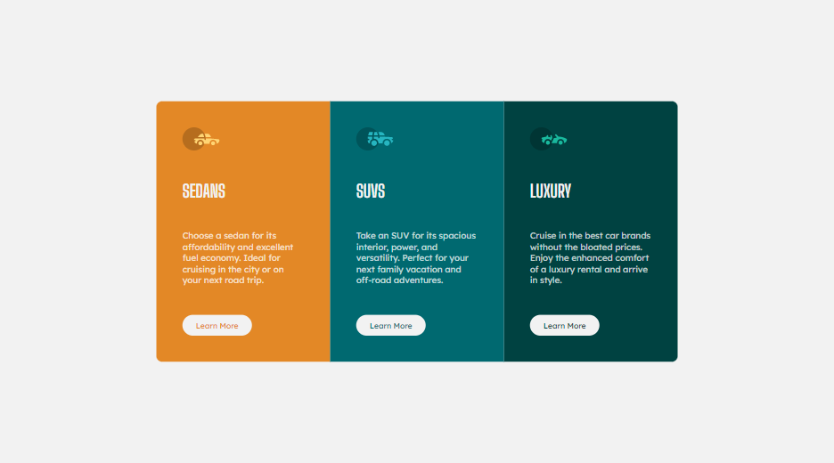

# Frontend Mentor - 3-column preview card component solution

This is a solution to the [3-column preview card component challenge on Frontend Mentor](https://www.frontendmentor.io/challenges/3column-preview-card-component-pH92eAR2-). Frontend Mentor challenges help you improve your coding skills by building realistic projects.

## Overview

### The challenge

Users should be able to:

- View the optimal layout depending on their device's screen size
- See hover states for interactive elements

### Screenshot

### Links

- Solution URL: [Add solution URL here](https://www.frontendmentor.io/challenges/3column-preview-card-component-pH92eAR2-/hub/3-column-preview-card-GiI6-5CUj)
- Live Site URL: [Add live site URL here](https://eloquent-poincare-2ec978.netlify.app/)

## My process

### Built with

- Solution URL: [Add solution URL here](https://www.frontendmentor.io/challenges/stats-preview-card-component-8JqbgoU62/hub/stats-preview-card-EYAwzsIny)
- Live Site URL: [Add live site URL here](https://nervous-khorana-2d49f3.netlify.app/)

## My process

### Built with

- Semantic HTML5 markup
- CSS custom properties
- Flexbox

## Author

- Website - [Yasha-Thakur](https://github.com/Yasha-Thakur)
- Frontend Mentor - [@Yasha-Thakur](https://www.frontendmentor.io/profile/Yasha-Thakur)
